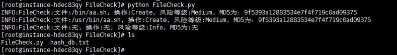

# FileCheck 0.1

本脚本旨在对指定监控目录进行文件hash记录，定时运行，发现文件替换、修改等后门可疑程序。

## Author ##

咚咚呛 

如有其他建议，可联系微信280495355

## Support ##

满足如下安全需求

	1、支持自定义文件目录监控
	2、支持目录递归监控
	3、支持文件hash记录并比较
	4、支持高危文件修改报警
	5、支持prelink服务排除
	

技术细节如下：

	1、针对自定义的路径进行递归遍历操作，并对文件进行hash保存
	2、当程序运行时先判断hash文件是否存在，不存在则创建，存在则获取当前文件hash与之比较
	3、自定义高危文件名称，当修改时则进行高危日志打印
	4、prelink服务会主动修改二进制文件，并记录prelink日志，当存在hash变动时，进行prelink日志检索，减少误报
	5、相关告警日志默认存储在/var/log/filecheck.log文件中
	6、hash文件保存在脚本目录名hash_db.txt中

## Test Environment ##

>centos 7
>
>python 2.6-3+

## Tree ##

	FileCheck
	----FileCheck.py		   	   #程序主程序

## Deploy ##
	
	脚本放置在任意目录中
	1）$ python FileCheck.py	 尝试运行并生成hash_db.txt
	2）配置crontab信息，定时执行，如5分钟一次。
	3）$ cat /var/log/filecheck.log 查阅告警日志

## Config ##

配置参数：FileCheck.py

	# 文件完整性检测目录，并递归子目录
	CHECK_DIR = ['/bin/', '/sbin/', '/usr/bin/', '/usr/sbin/', '/usr/local/sbin/', '/usr/local/bin/']
	# 重要高危告警文件名称
	HEIGH_FILE_ALARM = ['login', 'ls', 'ps', 'ifconfig', 'du', 'find', 'netstat', 'bash']
	# hash文件存储名称
	HASH_DB = sys.path[0] + '/hash_db.txt'
	# 日志告警文件存储位置
	ALARM_LOG = '/var/log/filecheck.log'
	# prelink服务会修改二进制文件，此处保存prelink服务的相关日志路径
	PRELINK_LOG_PATH = ['/var/log/prelink/prelink.log', '/var/log/prelink.log']

## Screenshot ##

